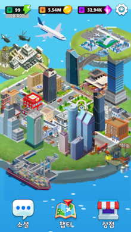
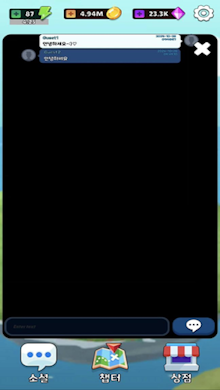
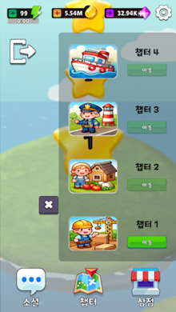
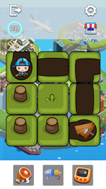

<h1>프로젝트 P</h1>
프로젝트 P"는 직관적이고 전략적인 퍼즐 메커니즘을 중심으로 개발된 타일 기반의 모바일 게임입니다. 
이 프로젝트는 ENP게임즈와의 협업을 통해 진행되었으며, 타일 회전을 활용해 경로를 연결하는 독창적인 퍼즐 플레이에 중점을 두었습니다.

## 스크린샷

|  |  |  |
|:---:|:---:|:---:|
| 로비 화면 | 골드 상점 | 아이템 상점 |

|  |  |  |
|:---:|:---:|:---:|
| 채팅 화면 | 챕터 선택 | 퍼즐 스테이지 |

## 목차
  - [개요](#개요) 
  - [개발 환경](#개발-환경)
  - [링크](#링크)
  - [구현한 컨텐츠](#구현한-컨텐츠)

## 개요
- **개발 기간:** 2024.08.07 ~ 2024.10.25
- **프로젝트 유형:** ENP게임즈, 기획반과 함께한 기업 협약 프로젝트

## 개발 환경
- **개발 엔진 및 언어:** Unity 2022.3.41f1 LTS, C#
- **IDE:** Jetbrains Rider, Visual Studio 2022

## 링크
- **포트폴리오:** https://docs.google.com/presentation/d/19l2XoyFLAfDf-xGGikJFF6cvrMUcxXei/edit?usp=sharing&ouid=113339804313850795218&rtpof=true&sd=true

## 구현한 콘텐츠

### 맵 툴 및 맵 생성
- UI를 통해 타일 맵을 직관적으로 제작할 수 있는 툴 개발
- JSON 데이터를 기반으로 다양한 퍼즐 맵 생성

### 타일 기믹 및 아이템
- 링크 타일, 워프 타일 등 다양한 기믹을 통한 전략적 플레이 제공
- 회전 제한 횟수 추가, 역회전, 힌트 아이템 구현

### 가상 자산 수집 및 사용
- 스테이지 클리어시 ERC-20 토큰 수집
- 토큰을 활용한 인게임 재화 구매 기능 구현

### 로비 시스템 및 미니게임
- 챕터 및 스테이지 진행에 따라 로비 화면이 발전
- 농부, 어부 등 다양한 액션성을 더한 미니게임 구현